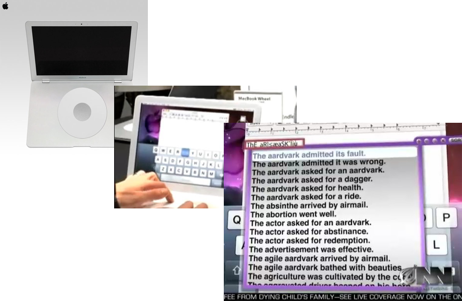
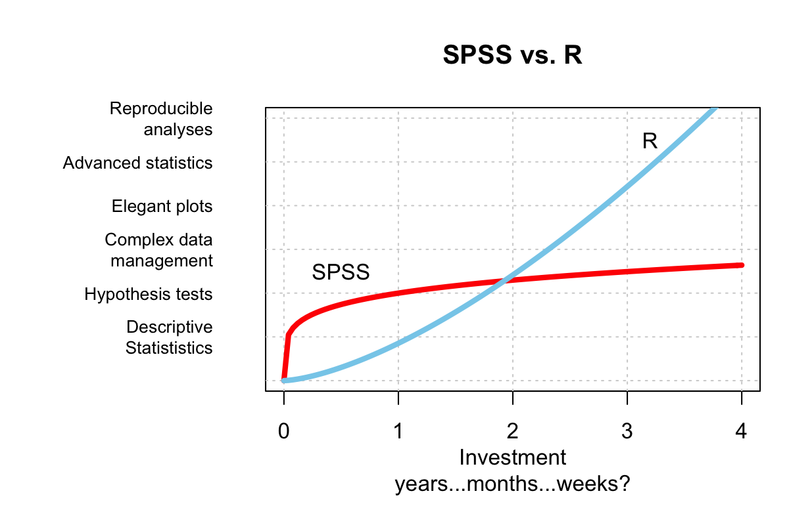

--- 


## Goals of this workshop


```{r, out.width = "75%", echo = FALSE}
knitr::include_graphics(c("images/excited.gif"))
```

### Get you excited about learning R!


--- &twocol

***=left

## Goals of this workshop

- You won't become a master of R today unfortunately -- but you will see how it can help solve (almost) all of your life's problems

***=right

```{r, echo = FALSE, out.width = "50%"}
knitr::include_graphics("images/Rlogo.png")

```

--- &twocol

## My R Journey

***=left

- 5 years struggling with SPSS

```{r, echo = FALSE, out.width = "80%"}
knitr::include_graphics("images/spsschain.png")
```

- Never quite did what I wanted.
- Never could replicate my analyses
- Didn't know how to do anything else
    
***=right

- 5 years of glorious R.

```{r, echo = FALSE, out.width = "80%"}
knitr::include_graphics("images/rwings.png")
```


- The first few months were tough
- Soon, I discovered new things every day
- In for the rest of the workshop, I'll show you what you can do with R

--- .class #id 

## Why is R so great?

1. Free and open source
2. Tell R what you want to do with your keyboard, rather than your mouse.
3. Statistics (duh)
4. Plotting
5. Simulations
6. Replication and Sharing
7. Writing reports and APA documents
8. Contributing to the R community
9. Bonuses!!

--- .class #id 
## Free and open source

- Unlike SPSS or Matlab, you can always get access to R
- Great free add ons like RStudio which make it easy.

--- .class #id 
## Use your keyboard, not your mouse

- Can you imagine writing a paper with a mouse instead of a keyboard?

```{r, echo = FALSE, out.width = "80%"}

```

--- &twocol
## How can I do a t-test comparing Y as a function of X?

***=left
### How do I do a t-test in SPSS?

1. Click Z, Z, then Z. Then move X to __, and Y to ___
2. Check a box for A, then B.
3. 

***=right

```{r, eval = FALSE}
t.test(y ~ x, data = data)
```


--- .class #id 
## Statistics

### Basics
- Hypothesis tests: `t.test()`, `cor.test()`, `chisq.test()`
- Regression, ANOVA: `lm()`, `anova()`

### Advanced
- Bayesian Statistics: `ttestBF()`, `anovaBF()`, `lmBF()`
- Heirarchical models: `lmer()`

--- .class #id 
## Plotting

- Graphics are like designer cars, when it's made by a great manufacturer (like R), you can see it. When it's made cheaply, (like SPSS), you can see that too.

1. SPSS Barplot vs. R pirateplot
2. SPSS scatterplot vs R scatterplot
3. R network plot
4. Fun plots: balloon plot


--- .class #id 
## Simulations

- Do you want to understand what a p-value is? Do a simulation!
- Do you want to know what predictions your theory makes? Do a simulation?

--- .class #id 
## Replication and Sharing

- Unlike SPSS, with R, all of your analysis is documented in code.
- No need to 'remember' what analyses you did.

--- .class #id 
## Writing documents and APA style papers

- Easily write reports that combine data, code, results, and test.
- Did you know that you can write APA style papers with R?

--- .class #id 
## Bonuses!

1. Create HTML presentations (like this one!) with `slidify`
2. Show interactive data and write experiments with Shiny
3. Contribute to R by creating your own R packages

--- &twocol
## Playing guitar

***=left

### SPSS
```{r, echo = FALSE, out.width = "100%"}
knitr::include_graphics("images/chordbuddy.jpg")
```

***=right
### R
```{r, echo = FALSE, out.width = "100%"}
knitr::include_graphics("images/guitar.jpg")
```


--- .class #id 
## R has a learning curve...but it's worth it!

```{r, echo = FALSE, out.width = "90%"}

```

--- .class #id 
## Practical tutorial

- Loading data.
- Descriptive statistics
- Plotting
- T-tests, correlation tests
- ANOVA
- Regression
- Simulations
- APA style papers with papaja

--- .class #id 
## I am ready to learn more R! What can I do?

| Book | Author | WebLink |
|:------|:------|:------|
| YaRrr! The Pirate's Guide to R|Me | [www.thepiratesguidetor.com](www.thepiratesguidetor.com) |
| R for Data Science|Wickham & Grolemund | [http://r4ds.had.co.nz/](http://r4ds.had.co.nz/)
| The R book | Crawley | [https://www.amazon.com/R-Book-Michael-J-Crawley/dp/0470973927](https://www.amazon.com/R-Book-Michael-J-Crawley/dp/0470973927) |
| Discovering Statistics using R | Field & Miles | [https://www.amazon.com/Discovering-Statistics-Using-Andy-Field/dp/1446200469/](https://www.amazon.com/Discovering-Statistics-Using-Andy-Field/dp/1446200469/) |

<br>

| Course | Link |
|:------|:------|
|Coursera|[https://www.coursera.org/courses?query=R](https://www.coursera.org/courses?query=R) |
|DataCamp |[https://www.datacamp.com/courses/free-introduction-to-r](https://www.datacamp.com/courses/free-introduction-to-r)|

#### Social Media
- www.r-bloggers.com, Facebook: R Users Psychology


--- .class #id 
## I am ready to learn more R! What can I do?

- Attend a multi-day bootcamp.
- Contact me at nathaniel.phillips@unibas.ch for future dates

