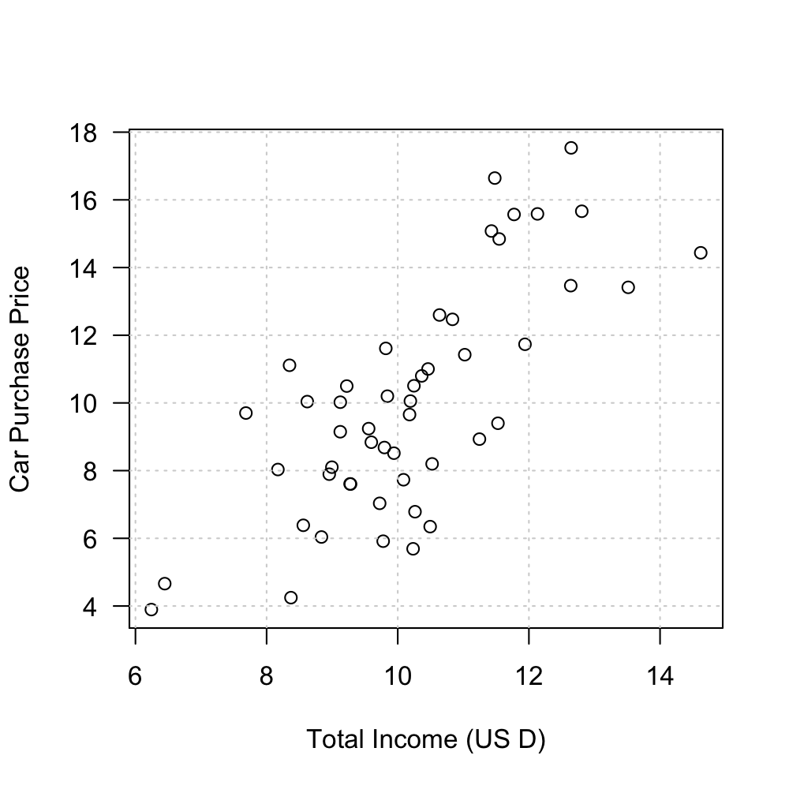
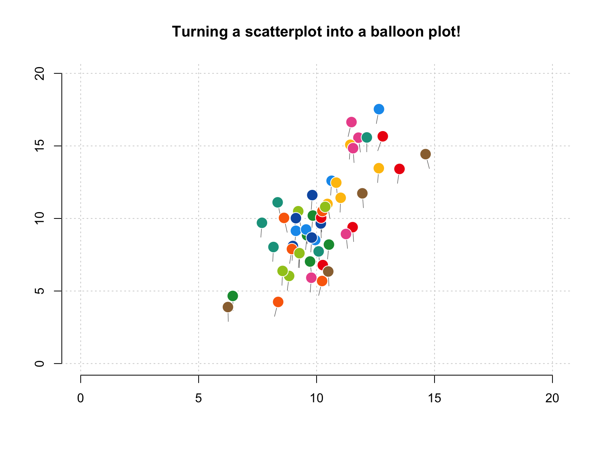

## Goal


### There is exactly one goal in this workshop

---

### Get you excited about learning R!


--- &twocol


## My R Journey

***=left

- 5 years struggling with SPSS


- Never quite did what I wanted.
- Never could replicate my analyses
- Didn't know how to do anything else
    
***=right

- 5 years of glorious R.


- The first few months were tough
- I discovered new things every day (and still am)
- Pretty soon, I could reproduce 6 months of SPSS analyses in an afternoon.

--- &twocol
## Two ways to learn guitar...

***=left

### ChordBuddy


***=right
### Fingers


--- .class #id 
## R has a learning curve...but it's worth it!


--- .class #id 
## R has a learning curve...but it's worth it!


--- .class #id 

## 10 reasons why R is so great


--- &twocol
## Reason 1. Free and open source

***=left
- Because R is <em>free and open source</em>, you can always get access to R (unlike SPSS and MatLab)


#### "To be able to choose between proprietary software packages is to be able to choose your master. Freedom means not having a master. And in the area of computing, freedom means not using proprietary software." -- Richard M. Stallman

<br>

#### "Closed source software [like SPSS and MatLab] is useless crap because it satisfies neither repeatability nor inspectability" -- Titus Brown
 
***=right


--- &twocol

## Reason 2: Statistics

***=left

Of course, R has all of the statistical analyes you could possibly want

### Basics
- Hypothesis tests: `t.test()`, `cor.test()`, `chisq.test()`
- Regression, ANOVA: `lm()`, `anova()`

### Advanced
- Bayesian Statistics: `ttestBF()`, `anovaBF()`, `lmBF()`
- Heirarchical models: `lmer()`
- Factor analysis: `factanal()`

***=right


--- &twocol
## Reason 3. Access to the latest, greatest

***=left
- Because it's open source, there is a huge community of R developers.
- If someone comes up with something cool, they will share it and you'll get immediate access.

***=right


<!-- --- .class #id  -->
<!-- ## Use your keyboard, not your mouse -->

<!-- - Doing statistical analyses with your mouse is as strange as using a mouse to write a paper. -->
<!-- - Typing allows you to specify exactly what you want. -->

<!-- ```{r, echo = FALSE, out.width = "50%"} -->
<!--  -->
<!-- ``` -->

<!-- [https://www.youtube.com/watch?v=9BnLbv6QYcA](https://www.youtube.com/watch?v=9BnLbv6QYcA) -->

<!-- --- &twocol -->
<!-- ## How can I do a t-test comparing Y as a function of X? -->

<!-- ***=left -->
<!-- ### How do I do a t-test in SPSS? -->

<!-- 1. Click Z, Z, then Z. Then move X to XX, and Y to YYY -->
<!-- 2. Check a box for A, then B. -->
<!-- 3. ... -->

<!-- ***=right -->
<!-- ### How do I do a t-test in R? -->
<!-- ```{r, eval = FALSE} -->
<!-- t.test(y ~ x, data = data) -->
<!-- ``` -->


--- &twocol

***=left
## Reason 4: Plotting

- Graphics are like designer cars, when it's made by a great manufacturer (like R), you can see it. When it's made cheaply, (like SPSS), you can see that too.

***=right


--- &twocol

## Barplot

***=left
## SPSS Barplot


***=right

## R pirateplot


---&twocol

## Two plots of the same data

***=left

## Barplot


***=right

## Pirateplot


---&twocol

## Scatterplot

***=left

## SPSS Scatterplot


***=right

## R scatterplot



---

## R balloon plot


--- &twocol

## More R plots

***=left
## Radar chart



***=right

## Text cloud


---
## Reason 5: Simulations

- In R, you can run simulations to directly answer important statistical questions


---
## Reason 6: Replication and sharing


--- .class #id 
## Reason 7: Writing reports and APA style papers


--- &twocol
## Reason 8: Write interactive websites and experiments with Shiny

***=left

1. Create interactive websites and even write entire experiments with RShiny


[https://econpsychbasel.shinyapps.io/ShinyBandit/](https://econpsychbasel.shinyapps.io/ShinyBandit/)


***=right


--- &twocol
## Reason 9: R is a transferable skill

***=left

- R is one of the top languages for statistical analysis (along with Python).
- If you learn R for psychology, you can use it in any other analytic field.


***=right


--- &twocol
## Reason 10: It's FUN

***=left

- You will have more fun with R than any other software, I promise.
- People use SPSS because they have to, people use R because they want to.

***=right


--- &twocol
## Why R is so great

***=left

1. Free and open source
2. Always have the latest, greatest methods
3. Tell R what you want to do with your keyboard, rather than your mouse.
4. Statistics (duh)
5. Plotting
6. Simulations
7. Replication and Sharing
8. Writing reports and APA documents
9. Contributing to the R community
10. Bonuses!!

***=right


#### Questions before the tutorial?

---
## Tutorial

### Get started 

1. Open RStudio
2. Open the `PsyKo.Rproj` file
3. Open `rmds/PsyKo_RBasics.Rmd` and go through the basics (or view online at [http://rpubs.com/YaRrr/PsyKo-RBasics](http://rpubs.com/YaRrr/PsyKo-RBasics))
4. Open `r/jordan_analyses.R` and replicate Jordan et al.
5. Open `rmds/jordan_apa.Rmd` and explore writing APA articles

---&twocol
## I am ready to learn more R! What can I do?

***=left

1. Find someone who knows R to help you
2. Get an R book or take an online course
3. Join an R group on social media
4. Attend an intensive R bootcamp
    - September, 2017: Basel

***=right


--- &twocol
## R books and Courses

***=left

| Book | Author | 
|:------|:------|
| YaRrr! The Pirate's Guide to R|Nathaniel Phillips | 
| R for Data Science|Wickham & Grolemund |
| The R book | Crawley | 
| Discovering Statistics using R | Field & Miles | 

<br>

| Course | Link |
|:------|:------|
|Coursera|[https://www.coursera.org/courses?query=R](https://www.coursera.org/courses?query=R) |
|DataCamp |[https://www.datacamp.com/courses/free-introduction-to-r](https://www.datacamp.com/courses/free-introduction-to-r)|

***=right


---&twocol
## Social Media

***=left

- www.r-bloggers.com
- Facebook: R Users Psychology

***=right


---
## Contact

This presentation: [https://ndphillips.github.io/PsyKo-March2017/](https://ndphillips.github.io/PsyKo-March2017/)

My Website: [http://ndphillips.github.io](http://ndphillips.github.io)

Email: Nathaniel.D.Phillips.is@gmail.com

YaRrr! The Pirate's Guide to R [https://www.thepiratesguidetor.com](https://www.thepiratesguidetor.com)


